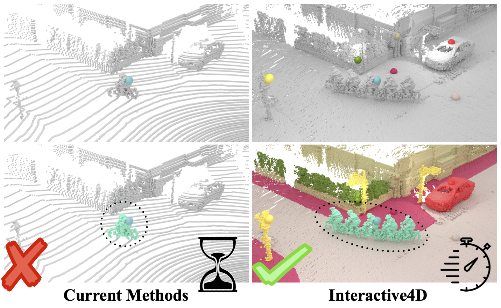

# Interactive4D: Interactive 4D LiDAR Segmentation

<div align="center">
<a href="https://github.com/Ilya-Fradlin/">Ilya Fradlin</a>, 
<a href="https://www.vision.rwth-aachen.de/person/245/">Idil Esen Zulfikar</a>, 
<a href="https://github.com/YilmazKadir/">Kadir Yilmaz</a>, 
<a href="https://theodorakontogianni.github.io/"> Theodora Kontogianni </a>, 
<a href="https://www.vision.rwth-aachen.de/person/1/">Bastian Leibe</a>

RWTH Aachen University

Interactive 4D segmentation is a new paradigm that segments multiple objects across consecutive LiDAR scans in a single step, improving efficiency and consistency while simplifying tracking and annotation.

<a href="https://pytorch.org/get-started/locally/"></a>
<a href="https://pytorchlightning.ai/"></a>
<a href="https://black.readthedocs.io/en/stable/"></a>



</div>
<br><br>

[[Project Webpage](https://vision.rwth-aachen.de/Interactive4D)] [[arXiv](https://arxiv.org/abs/2410.08206)]

<details open="open" style='padding: 10px; border-radius:5px 30px 30px 5px; border-style: solid; border-width: 1px;'>
  <summary>Table of Contents</summary>
  <ol>
    <li>
      <a href="#news-newspaper">News</a>
    </li>
    <li>
      <a href="#bibtex-scroll">BibTeX</a>
    </li>
    <li>
      <a href="#acknowledgment-pray">Acknowledgment</a>
    </li>
  </ol>
  </ol>
</details>

## News :newspaper:

- Interactive4D (Under Review).
- **Code coming soon...**

## BibTeX :scroll:

```
@article{fradlin2024interactive4d,
  title     = {{Interactive4D: Interactive 4D LiDAR Segmentation}},
  author    = {Fradlin, Ilya and Zulfikar, Idil Esen and Yilmaz, Kadir and Kontogianni, Thodora and Leibe, Bastian},
  journal   = {arXiv preprint arXiv:2410.08206},
  year      = {2024}
}
```

## Acknowledgment :pray:

**We extend our sincere thanks to all the volunteers who participated in our user study!**

We thank Yuanwen Yue, Daan de Geus, and Alexander Hermans for their helpful feedback and discussions. We also thank all our annotators who participated in the user study. Theodora Kontogianni is a postdoctoral research fellow at the ETH AI Center and her research is partially funded by the Hasler Stiftung Grant project (23069). Idil Esen Zulfikar’s research is funded by the BMBF project NeuroSys-D (03ZU1106DA). Kadir Yilmaz's research is funded by the Bosch-RWTH LHC project Context Understanding for Autonomous Systems. The computing resources for most of the experiments were granted by the Gauss Centre for Supercomputing e.V. through the John von Neumann Institute for Computing on the GCS Supercomputer JUWELS at Julich Supercomputing Centre.

Portions of our code are built upon the foundations of [Mask4Former](https://github.com/YilmazKadir/Mask4Former) and [Agile3D](https://github.com/ywyue/AGILE3D).
