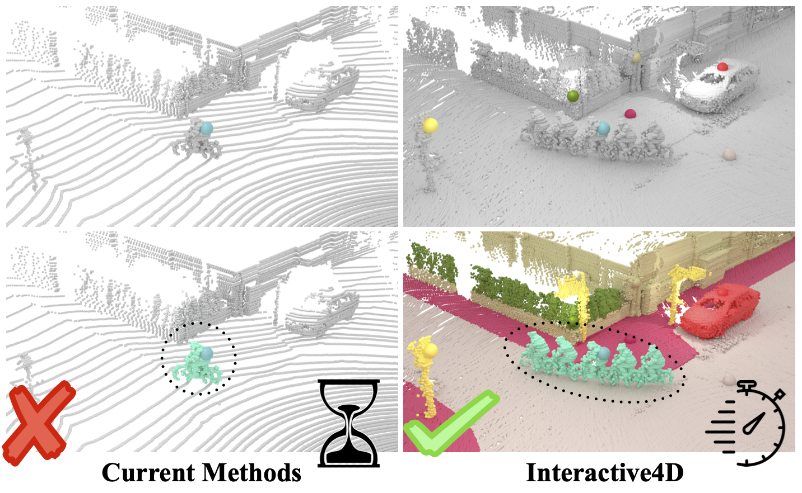
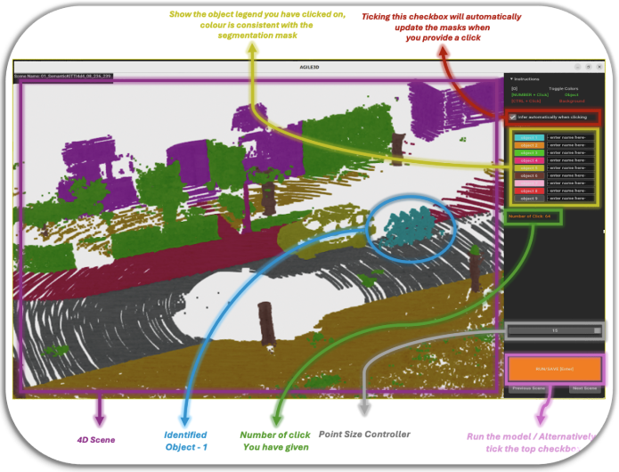

# **Interactive 4D Segmentation Tool**

## Introduction

This tool enables you to segment and annotate holistically **multiple 3D scans**, where time serves as the fourth dimension. Consecutive LiDAR scans from an autonomous driving scenario are fused, allowing you to observe how objects move and change over time. Moving objects can appear as “ghosts,” since multiple positions of the same object are included in the combined point cloud.



**Key Features**

- **4D Scene Composition**: Each scene merges four consecutive LiDAR scans.
- **Holistic Multi-Object Annotation**: Annotate multiple objects in a single pass, with each object assigned a unique ID.
- **Open-World Setting**: Designed to handle real-world scenarios with diverse and unknown objects.

---

## Prerequisites

1. **Environment Setup**
   - Follow the installation instructions in the main [README.md](../README.md) of this repository to prepare dependencies and conda environments.
2. **GPU Requirements**
   - The provided sample scenes and default settings should run on GPUs with ~11 GB memory (e.g., NVIDIA GeForce GTX 1080 Ti).
   - For larger-scale scenes, or higher count of superimposed scans, higher memory GPUs may be necessary (e.g., 24 GB+).

---

## **Step 1: Download Pretrained Model**

- Obtain the **Interactive4D - 4D setup** pretrained weights from [this link](https://omnomnom.vision.rwth-aachen.de/data/interactive4d/interactive4d_sweep4.ckpt).
- Although trained exclusively on the [SemanticKITTI](https://www.semantic-kitti.org/) dataset, the model can also be applied to other datasets (e.g., [nuScenes](https://www.nuscenes.org/), [KITTI-360](https://www.cvlibs.net/datasets/kitti-360/)) for segmentation tasks.

---

## **Step 2: Prepare Scene Data**

The interactive tool requires each scene to be provided as a **`.ply` file** file that already represents a superimposed point cloud, created by merging multiple consecutive scans. This following preprocessing step ensures that the scene is fully combined and ready for annotation.

### Option 1: Download Sample Data

- [**Sample Data**](https://omnomnom.vision.rwth-aachen.de/data/interactive4d/sample_data.zip)
  - Includes 4 scenes, 2 from SemanticKITTI and 2 form nuScenes, cropped to fit in ~11 GB GPU memory.
  - Each scene combines **4 consecutive scans**.

### Option 2: Generate Scenes from SemanticKITTI

Use the provided script to create new 4D scenes from SemanticKITTI:

```shell
python interactive_tool/semantickitti_4d_generator.py \
  --scans_data_file /path/to/semantickitti_validation_list.json \
  --save_dir /path/to/output_interactive_scenes \
  --save_with_gt true \
  --sweep 4 \
  --start_scan 100 \
  --radius 30
```

- For labeling and IoU calculation, include label; otherwise, IoU scoring will be unavailable.

### Option 3: Prepare Your Own Scans

1. `scan.ply` must include at least:

```python
  ["x", "y", "z", "red", "green", "blue", "time", "intensity", "distance"]
```

3. If a "label" field is specified, an IoU score will be calculated. Otherwise, IoU scoring will be unavailable.
4. If you lack color data, set red = green = blue = 0.
5. Ensure z-axis is up, and coordinates are in metric scale (meters).
6. For extremely large point clouds, crop unneeded areas to prevent out-of-memory issues.

---

## Step 3: Configure the GUI

After preparing your scenes, ensure that your directory structure matches the following example:

**Directory Structure Example**:

```shell
└── interactive_dataset/
    ├── scene_*****/
    |    ├── scan.ply
    ├── scene_*****/
    ├── ...
```

All prediction results will be saved inside each `scene_****/` folder, under a subdirectory named for the chosen `--user_name`.

<details open 
  style="
    padding: 10px;
    border: 1px solid #ccc;
    border-radius: 8px;
    background-color: #f6f8fa;
  "
>
<summary><span style="font-weight: bold;">Annotation Tool Configuration</span></summary>

- The `conf/config.yaml` file must be set up properly to initialize the model. See the main [README.md](../README.md) for a comprehensive explanation. Key parameters include:

  - **`data_dir`**: Paths to your dataset.
  - **`ckpt_path`**: Path to the pretrained weights (e.g., `interactive4d_sweep4.ckpt`).
  - **Other runtime parameters**: Such as `sweep`, `voxel_size`, etc.

- Additional command-line arguments (which can override certain config values) include:
  - **`--user_name`**: Used to name the folder where predictions are stored.
  - **`--pretraining_weights`**: Points to the checkpoint/weights file (e.g., `interactive4d_sweep4.ckpt`).
  - **`--dataset_scenes`**: Path to the directory containing the prepared scenes (i.e., `interactive_dataset` shown above).
  </details>

---

## Step 4: Run the Tool

**1. Launch Command:**

```shell
python scripts/run_UI.py \
  --user_name user_00 \
  --weights interactive4d_sweep4.ckpt \
  --dataset_scenes interactive_scenes
```

2. Once launched, the GUI will display the merged LiDAR scene and offer interactive annotation features.

<p align="center">
  
</p>

---

## Quick User Instructions

**1. 3D Scene Manipulation**

- Left Mouse + Drag: Rotate the scene.
- Right Mouse + Drag: Translate the scene.
- Scroll Wheel: Zoom in/out.

**2. Click-to-Label**

- **Keyboard key (numbers or letters) + Left Click**: Assign points to an object (e.g., key "1" → object 1, key "x" → object x).
- **CTRL + Left Click**: Assign points to the background.
- By design, the model expects **at least one initial click per object** before generating the first prediction. This step mirrors the training procedure, where each object must be explicitly marked. If any object is missed at this stage (which may produce incomplete masks), you can still correct and refine the segmentation by adding more clicks for missed or incorrectly segmented objects, ultimately still achieving a full (holistic) annotation of the scene.

  > **Why require an initial click per object?**  
  > While it might have been possible to train the model to detect and label individual objects and classify unselected background objects automatically, we deliberately chose to emphasize explicit, user-driven labeling. Our goal is to integrate this tool with fully autonomous panoptic segmentation methods (e.g., [Mask4Former](https://github.com/YilmazKadir/Mask4Former)), which would generate initial masks automatically. Users would then only need to provide corrective clicks for refinement, reducing the overall annotation effort to only where it's really needed.

**3. Refinement**

- After initial labeling, correct errors by clicking again on mislabeled regions.
- Holding a **key i** and clicking reassigns points to **object i**, while **CTRL + Left Click** reassigns to **background**.

**4. Automatic Inference**

- If “**Infer automatically when clicking**” is enabled, the model updates segmentation masks after each click without requiring you to press **“RUN/SAVE [Enter]”**.
- Otherwise, click **“RUN/SAVE [Enter]”** to propagate your new clicks to the model.

**5. Point Size Slider**

- Allows the visual adjustments of the points' size for better clarity, especially in sparse areas.

**6. Additional Tips**

- Aim your clicks accurately at the intended object region for best results.
- Press “~” to toggle between different views (e.g., your segmentation mask vs. original colored point cloud - if given).
- A color palette and corresponding key references are shown in the GUI for clarity.

---

**Happy Annotating!**

We hope this tool accelerates your 3D labeling process and helps in generating high-quality 4D segmentation datasets.

---

If you encounter any issues, open an [issue on GitHub](https://github.com/Ilya-Fradlin/Interactive4D/issues) or reach out to the maintainers.

Our implementation builds on the [AGILE3D](https://github.com/ywyue/AGILE3D) interactive tool. We have adapted it for **large-scale, sparse outdoor domains**. For indoor segmentation, additional functionalities and additional examples, please refer to the original [AGILE3D segmentation tool](https://github.com/ywyue/AGILE3D/blob/main/demo.md).
